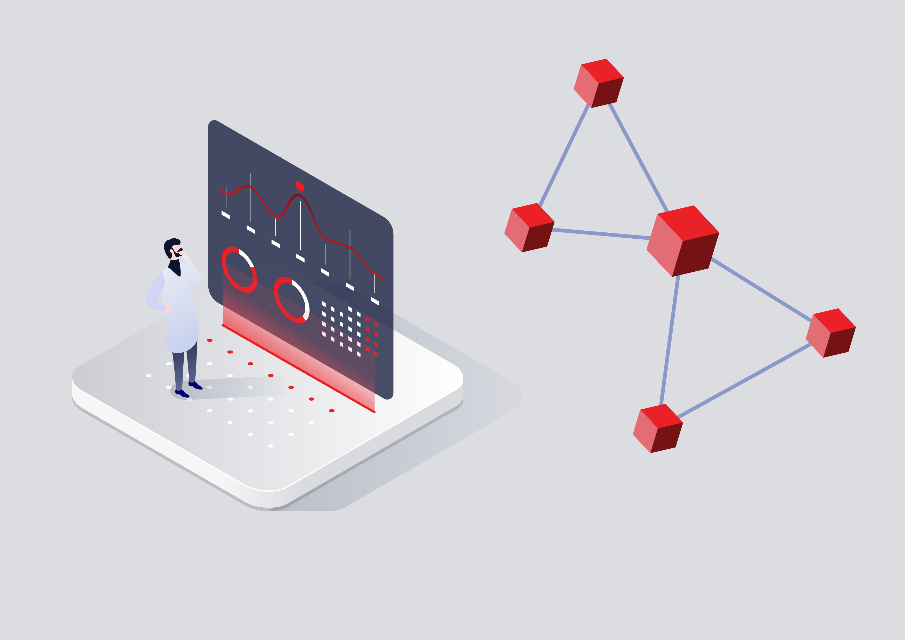
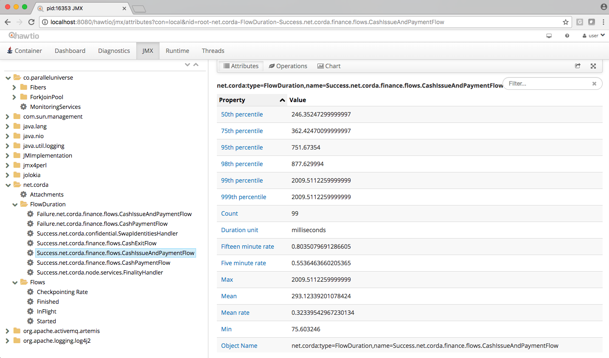
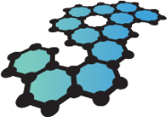
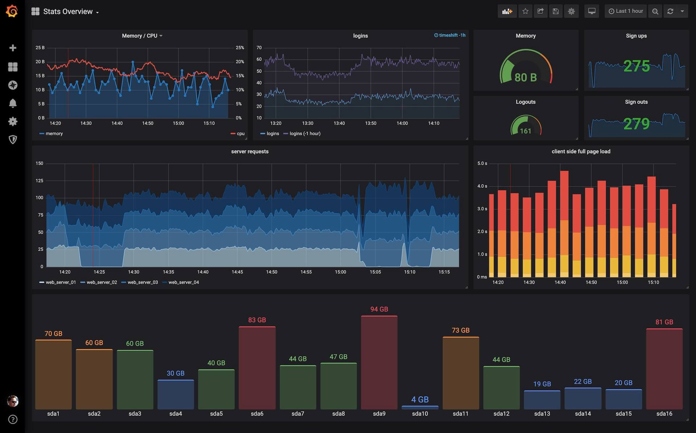
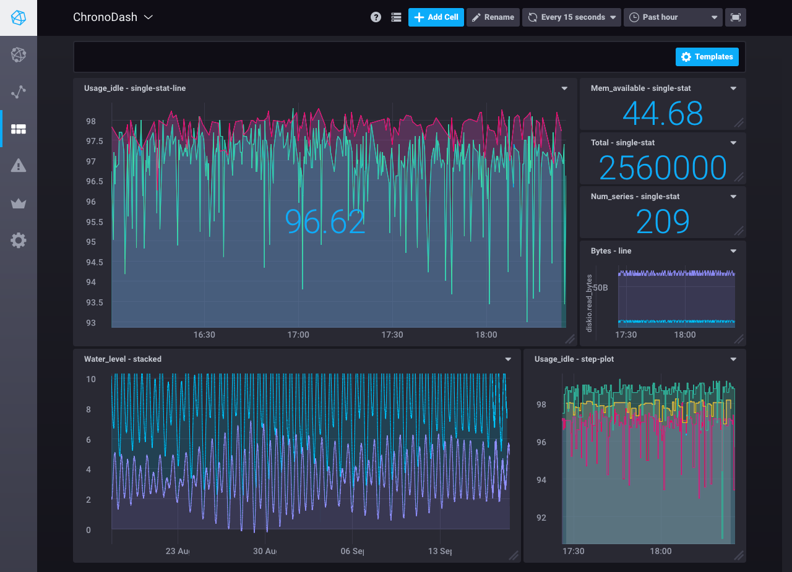
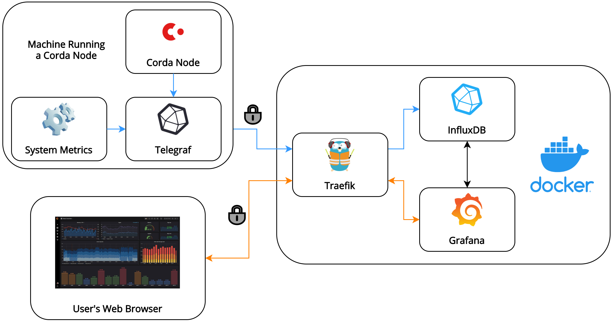
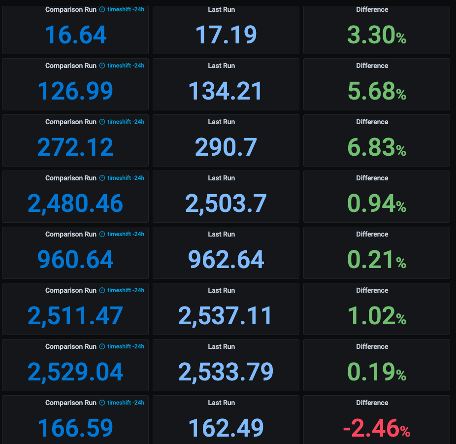

> **This post is also hosted on the [Corda Blog](https://www.corda.net/blog/monitoring-corda-nodes-using-grafana-influxdb-and-telegraf/).** The main goal behind this post was to provide an easily accessible high-level overview on monitoring Corda nodes. It also showcases part of what I've done during my summer internship at R3.

## Intro

Here at R3, we have a cluster of Corda nodes that we use for performance testing. We have developed a [performance testing suite](https://docs.corda.net/docs/corda-enterprise/performance-testing/toc-tree.html) that enables us to establish baseline numbers, quantify improvements from new features, and identify regressions.

We recently decided to invest some effort in improving the observability of the overall system so that we could identify regressions and analyse their root cause more efficiently and with less manual work. There is [a wealth of metrics exposed by Corda nodes via JMX](https://docs.corda.net/docs/corda-enterprise/node-metrics.html) that can be inspected using tools such as [Hawtio](https://hawt.io/) (as [described in the Corda docs](https://docs.corda.net/docs/corda-enterprise/node/operating/monitoring-logging.html)). However, this approach requires plenty of manual intervention and the prerequisite of the test actively running during inspection times.

_Corda JMX metrics visible in Hawtio_

We had to set up a monitoring infrastructure that would allow us to:

- Collect the metrics exposed by our Corda nodes via JMX.

- Collect the metrics not exposed via JMX, such as disk IO and network activity.

- Store the collected metrics in a centralised database.

- Visualise, filter, and compare metrics from different time windows using a front end accessible from a web browser.

Monitoring is a core aspect of operating Corda nodes efficiently. Therefore, in this post we give you a quick overview of the technologies available and their trade-offs. We also walk you through the capabilities and the architecture of our solution. The described work has been performed on Corda 4.5, but the high-level architecture is really version-agnostic. We hope this can help those of you getting started with monitoring!

## Hosting the monitoring infrastructure

The first step was to decide how to host the monitoring infrastructure, as that would greatly impact the choice of other tools that we could use. Ultimately it came down to either using a third-party managed service or deploying the infrastructure ourselves in the public cloud.

### Third-party managed services

This would be a great option if we wanted a scalable solution without us having to spend too much time setting up the infrastructure and managing it, or if it was to support production workloads that would have strict requirements for high availability. Given that we only wanted to monitor the nodes in our cluster and didn’t intend for it to scale beyond that, using a third-party service wouldn’t have been cost-effective as it would have provided many more features than were necessary for us.

We also wanted the ability to have multiple users access dashboards simultaneously, and the possibility for user authentication. These features were only accessible in the higher tiers of such services, which provide much more storage and bandwidth than we required.

### Self-hosting

We ended up going down the path of hosting the monitoring infrastructure ourselves in Microsoft Azure. The most popular tools for setting up monitoring solutions provide open source offerings so this was a viable option. It also has the added benefits of giving us full control over the infrastructure and knowing the exact running costs.

## Comparison of tools

As we chose to self-host the monitoring infrastructure, we had the liberty of choosing from the multitude of open source tools available to set up our infrastructure. We carefully considered which tools to use so that the monitoring infrastructure wouldn’t require much effort to maintain in the long run.

Effectively the monitoring infrastructure can be split up into three parts:

1. A metric collection agent.

1. A time-series database (TSDB).

1. A front end for visualising and querying the TSDB.

The descriptions of each part below provide details about the tool we chose to use, followed by alternatives that we had also considered.

### Metric collection agent

⭐ [**Telegraf**](https://www.influxdata.com/time-series-platform/telegraf)— a lightweight open source server agent that [can collect and write metrics to and from different sources](https://docs.influxdata.com/telegraf/latest/plugins/). It’s plug-in driven so we could easily set it up using the provided [jolokia2 plug-in](https://github.com/influxdata/telegraf/tree/master/plugins/inputs/jolokia2) to collect the metrics exposed through JMX from our Corda nodes.

Telegraf also provides plug-ins that allow for monitoring various system metrics which aren’t available through JMX, such as disk IO and networking usage. In our case, it was so convenient to configure that we also deployed it on our [Corda node databases](https://docs.corda.net/docs/corda-os/node-database.html) with the relevant [PostgreSQL](https://github.com/influxdata/telegraf/tree/master/plugins/inputs/postgresql) and [SQL Server](https://github.com/influxdata/telegraf/tree/master/plugins/inputs/sqlserver) plug-ins.

**Other options** — we also considered [**Prometheus JMX exporter**](https://github.com/prometheus/jmx_exporter), [**jmx2graphite**](https://github.com/logzio/jmx2graphite), and [**jmxtrans**](https://github.com/jmxtrans/jmxtrans). The issue with these is that they are all limited to which metrics they can record and where they can send them to. Telegraf can provide essentially the same functionality as those tools and allows for extensibility, while greatly reducing the number of tools required for maintenance.

### Time-series database

⭐ [**InfluxDB**](https://www.influxdata.com/products/influxdb-overview/) — an open source TSDB from InfluxData, who also develop Telegraf. It’s [easy to install on many different platforms](https://docs.influxdata.com/influxdb/v1.8/introduction/install/) and can be interacted with using the SQL-like [InfluxQL](https://docs.influxdata.com/influxdb/v1.8/query_language/) query language.

This is the TSDB we ended up using. So far it’s been working well, but a slight gripe with it is that the default query language (InfluxQL) is not quite powerful enough for certain tasks, such as performing calculations on data over different time windows. This is remedied by using InfluxData’s new [Flux](https://www.influxdata.com/products/flux) query language, albeit at the cost of convenience due to a lack of simplified GUI for it in TSDB front ends — the queries have to be written in plain text. Before choosing InfluxDB we’d recommend checking [this aggregate GitHub issue](https://github.com/influxdata/influxdb/issues/5930) to see if you’d heavily rely on any query operators that have not yet been implemented in InfluxQL.

Overall, Flux is still significantly more powerful than Prometheus’ and Graphite’s query languages. InfluxDB can be the best option if you don’t mind sacrificing some ease of use sometimes for the ability to write (almost) any query imaginable.

[**Prometheus**](https://prometheus.io) — another popular open source TSDB, which is entirely community-driven. It uses a similar [data compression algorithm to InfluxDB](https://prometheus.io/docs/introduction/comparison/#summary-0). The query language ([PromQL](https://prometheus.io/docs/prometheus/latest/querying/basics)) is more robust than InfluxQL so you can do more out of the box, although it doesn’t resemble any particular language so requires learning from scratch.

One of the biggest differences in Prometheus compared to other TSDBs is that it [pulls instead of pushing metrics](https://prometheus.io/docs/introduction/faq/#why-do-you-pull-rather-than-push). This has some advantages, but also requires additional setting-up on the machines that run your Corda nodes to allow Prometheus to pick up the exported metrics, which entails opening extra ports and setting up firewall rules.

It was tough choosing between Prometheus and InfluxDB, but ultimately we went with InfluxDB due to it being maintained by the same people as Telegraf, the potential to write complex queries using Flux and requiring less setup to collect metrics from our Corda nodes.

[**Graphite**](https://graphiteapp.org) — the grandaddy of modern TSDBs. Graphite has been around for longer than Prometheus and InfluxDB, so it’s a mature and tested tool. The query language resembles some programming languages so it’s easy to pick up, and it can do more than InfluxQL and PromQL thanks to the huge selection of functions that have been developed over the years.

Being the oldest of the bunch has its disadvantages though, most notably that the [performance is lacklustre compared to InfluxDB](https://www.influxdata.com/blog/influxdb-outperforms-graphite-in-time-series-data-metrics-benchmark) which would have to be accounted for by using a more powerful host VM. Installing Graphite can also be a pain due to its [many dependencies](https://graphite.readthedocs.io/en/latest/install.html#dependencies) if it’s not deployed in Docker (inspiring projects such as [Synthesize](https://github.com/obfuscurity/synthesize/) that are meant to make the process easier).

### Front end for visualising and querying the TSDB

_Example Grafana Dashboard_

⭐ [**Grafana**](https://grafana.com) — an open source tool for interactively visualising data from various data sources. Grafana is by far the most popular tool for interacting with TSDBs with over [1200 contributors on GitHub](https://github.com/grafana/grafana) and a very active [community forum](https://community.grafana.com/). There are [many plug-ins available for it](https://grafana.com/grafana/plugins), it integrates well with many other services for [alerting](https://grafana.com/docs/grafana/latest/alerting/notifications/) and [authentication](https://grafana.com/docs/grafana/latest/auth/overview/), and it makes creating aesthetically pleasing dashboards a breeze.

_Example Chronograf Dashboard_

[**Chronograf**](https://www.influxdata.com/time-series-platform/chronograf) — an open source tool for interacting and visualising data from InfluxDB. Chronograf is very well suited for setups where other products from InfluxData are used, as it’s better integrated with them compared to Grafana. This could have been a great option if we also used [Kapacitor](https://www.influxdata.com/time-series-platform/kapacitor/) as a real-time streaming data processing engine from InfluxData, to complete their “[TICK](https://www.influxdata.com/blog/introduction-to-influxdatas-influxdb-and-tick-stack/)” stack.

Given that Chronograf has fewer features than Grafana and [is significantly less popular](https://github.com/influxdata/chronograf/graphs/contributors), which can make getting support for it more difficult, we went with Grafana.

## Extra considerations

### Why deploy in Docker?

As all tools we chose provided official Docker images, we decided to deploy our monitoring infrastructure as a [Docker Compose](https://docs.docker.com/compose) application in an Azure VM. This has many benefits:

- Deploying the monitoring infrastructure is a one-step process and is easily reproducible.

- Updating and downgrading individual services is straightforward — just adjust the version of the Docker images!

- It’s easy to manage each container’s data as it’s kept in separate Docker volumes.

- The solution can be easily tested locally and will behave the same locally as on a production server.

### Securing the monitoring infrastructure

To encrypt the traffic coming in and out of our monitoring infrastructure, we used [Traefik](https://docs.traefik.io/) which can automatically renew and obtain TLS certificates for our monitoring infrastructure from [Let’s Encrypt](https://letsencrypt.org). Traefik is an open source edge router that acts as a reverse proxy for our Docker containers. It can be deployed using [official Docker images](https://hub.docker.com/_/traefik), so it integrates perfectly into our Docker Compose application.

We defined separate Traefik [services](https://docs.traefik.io/routing/services/) and [routers](https://docs.traefik.io/routing/routers/) for Grafana and InfluxDB that take care of appropriate routing, HTTP/HTTPS redirection, and TLS configuration. This was all done in a declarative way using [labels in our Docker compose file](https://docs.traefik.io/routing/providers/docker/).

Grafana supports [user authentication](https://grafana.com/docs/grafana/latest/auth/overview), which can be integrated with many different services including Azure and GitHub. This also allows for easy management of permissions of the users accessing our Grafana dashboards.

### Deployment of Telegraf

Telegraf can be installed on the machines running Corda in a [variety of ways](https://docs.influxdata.com/telegraf/latest/introduction/installation) and works as a stand-alone tool. Setting it up is relatively straightforward, so you can choose whichever installation method most suits your setup.

## Complete infrastructure architecture

The complete architecture of our infrastructure looks as follows:

TLS is terminated at our reverse proxy (Traefik). This means that traffic between the proxy and Grafana/InfluxDB is not encrypted, but this isn’t an issue since all these services are running in a single secured machine.

## Final result

We set up a Grafana dashboard with metrics for each Corda node in our cluster. The dashboard features high-level flow metrics first, followed by internal operation metrics (P2P, caches), and finally system-level metrics (JVM, disk IO, network). A part of this dashboard is shown below.

We also have a dashboard with a summary of the results from our performance testing suite, which helps us inspect the results quickly and identify potential regressions. A part of it that shows throughput numbers for some of our test cases is shown below. This is made possible by sending data from our test suite running JMeter to InfluxDB using the [JMeter InfluxDB Backend Listener](https://jmeter.apache.org/usermanual/realtime-results.html).

The “Difference” column displays the results of a Flux query performed on our InfluxDB database, repeated for every test case using [Grafana’s variable feature](https://grafana.com/docs/grafana/latest/variables/repeat-panels-or-rows/). It calculates the difference in results of each test case between the currently specified run and a run that happened a certain time ago (in this example 24 hours ago).

## Conclusion

A complete solution for monitoring Corda nodes can be set up entirely using open source tools without compromises. Many of the tools can be mixed and matched, so it’s possible to adjust the foundation described in this post to better fit your individual needs and existing setup.

One of the most impactful choices to be made when setting up a monitoring solution for Corda nodes is the choice of TSDB, as that will greatly affect the performance and usability of your dashboards. InfluxDB and Prometheus are strong TSDB options which have many discerning features that can make one more favourable over the other, depending on your requirements.

For more information on monitoring Corda nodes, check the following articles:

- [Monitoring Corda Nodes With Prometheus, Grafana and ELK on Docker](https://www.corda.net/blog/monitoring-corda-nodes-with-prometheus-grafana-and-elk-on-docker-2/)

- [Monitoring Corda Nodes using Prometheus and Grafana](https://www.corda.net/blog/monitoring-corda-nodes-using-prometheus-and-grafana/)

- [Monitoring Corda Nodes (Part 1)](https://www.corda.net/blog/monitoring-corda-nodes-part-1/)

The Corda documentation is also an amazing resource:

- [Node metrics](https://docs.corda.net/docs/corda-enterprise/node-metrics.html)

- [Node monitoring and logging](https://docs.corda.net/docs/corda-enterprise/node/operating/monitoring-logging.html)

**Want to learn more about building awesome blockchain applications on Corda? Be sure to visit [corda.net](http://corda.net/), check out our [community page](https://www.corda.net/community/) to learn how to connect with other Corda developers, and [sign up](https://info.r3.com/email-preferences) for one of our newsletters for the latest updates.**

— Dominik Rys is a Software Engineer Intern at [R3](https://www.r3.com/), an enterprise blockchain software firm working with a global ecosystem of more than 350 participants across multiple industries from both the private and public sectors to develop on Corda, its open source blockchain platform, and Corda Enterprise, a commercial version of Corda for enterprise usage.
