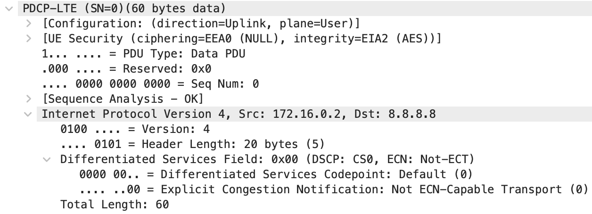

For part of my bachelor's dissertation, I implemented and executed a bit-flipping attack on encrypted IP packets in LTE networks. The attack was first documented by David Rupprecht et al. in their academic paper ["Breaking LTE on Layer Two"](https://alter-attack.net/).

The attack is possible due to a specification flaw in LTE standards, where IP packets **not integrity protected**. Therefore, a man-in-the-middle (MITM) attacker can modify the packets and the receiver will decrypt them successfully, since it can't verify the authenticity of the data. The specifics on how this is possible are explained later in this post.

I learned a lot while implementing this attack which I thought would be worth documenting and sharing. Some of this post will refer to LTE networks specifically, but I will try to keep much of it general. This post will encompass how to do bitmasking comfortably in C++, how to find packet offsets using appropriate tools, and how to compensate for any checksum errors in IP packets.

## Stream Cipher Attack Explanation

In most LTE networks, IP packets are encrypted with a **stream cipher** (AES-CTR), where the encryption algorithm generates streams of bytes (called **keystreams**) which are XORed with the message plaintext in order to obtain the ciphertext. The receiver can then generate the same keystream and XOR it with the encrypted message to obtain the plaintext.



As explained at the start of the post, a MITM attacker attacker can successfully modify packets in LTE networks and the receiver will be able to decrypt them. This is known as a [malleable cipher](https://en.wikipedia.org/wiki/Malleability_(cryptography)). This property can be used by an attacker to modify the ciphertext in such a way that it decrypts into *any* chosen plaintext, if the original plaintext is known. I highly recommend reading a short description of how the attack works on [Wikipedia](https://en.wikipedia.org/wiki/Stream_cipher_attacks#Bit-flipping_attack).

As an example in the context of LTE networks, the network provides the IP of the DNS server that connected devices should use for DNS resolution. In effect, the plaintext of the destination IP of DNS requests is known. An attacker can restrict the mask it applies to the ciphertext to only cover the destination IP field, since the offset of it is known. The attack can therefore change the destination IP an arbitrary address (within limits) and hijack the request.



## Implementing the Bit-Flipping Stream Cipher Attack in C++

Now with the basics out of the way, I will explain how to implement a bit-flipping stream cipher attack where the plaintext is known in C++.

### Obtaining Field Offsets

The encrypted packets can be encapsulated in various protocols, so the offset at which to apply the bitmask will differ depending on the context. With more common protocols you can easily find this information on the internet. In other cases, Wireshark and some testing may be needed.

In my case, I was working with IPv4 packets encapsulated in the LTE PDCP protocol. Obtaining the offset of the destination IP in the IPv4 packet was trivial, but I found [Salim Gasmi's Hex Packet Decoder](https://hpd.gasmi.net/) to be an excellent tool to help with this. The PDCP protocol only adds a 2-byte header to the front of IP packets, so the offset found before had have 2 added to it for it to work in the context of PDCP packets.

To additionally verify if my assumptions were correct, I checked example packets in Wireshark. This would also need to be done when working with more exotic protocols. To obtain sample packets, I captured packets in a test setup with known keys such that the packets can be decrypted. Since we're working with a stream cipher, the offsets will be the same whether encryption is enabled or not. In the Wireshark trace, I was able to verify that the offset is what I thought it would be. Below, you can see the Wireshark capture from which I could tell that the offset is shifted by 2 due to the 2-byte header.





### Applying Bitmasks to Parts of Payload in C++

We now have the required offsets at which to mask parts of our packets. The next step is to apply the bitmask by XORing it with the encrypted payload. In my case of using [srsLTE](https://www.srslte.com/) and LTE networks, the payload was represented by a `uint8_t` array.

To comfortably tweak my implementation and test it without having to set up an entire test LTE network, instead I grabbed some example payloads (encrypted and unencrypted) from a test run and serialised them into a hex string. Then, my test script serialised it back into raw bytes. The code I personally used is by [Robbie Rosati on StackOverflow](https://stackoverflow.com/questions/17452689/read-write-binary-object-as-hex/17452690#17452690).

To calculate the manipulation mask, the plaintext XORed with the plaintext that you would like to change it to. In C++ this is greatly eased by using a `std::valarray`. Then, the mask is XORed with the payload at the appropriate offset. Overall, the entire implementation looks as follows:

```cpp
void apply_mask(uint8_t* buf, std::valarray<int> mask, int offset)
{
  for (size_t i = offset; i < offset + mask.size(); i++) {
    buf[i] ^= mask[i - offset];
  }
}

int main() {
  // De-serialise example payload (for testing only)
  std::string buf_str = "80004500004ce33d00007811";
  uint8_t buf[buf_str.length() / 2];
  object_from_hex(buf_str, &buf);

  // Store plaintext and the modified plaintext as std::valarray
  std::valarray<int> dest_ip_modified{178, 62, 108, 207};
  std::valarray<int> dest_ip_plaintext{103, 123, 226, 10};

  // Calculate the manipulation mask
  auto ip_mask = dest_ip_plaintext ^ dest_ip_modified;

  // Store the previously found offset
  int pdu_dst_ip_byte_offset = 18;

  // Apply the manipulation mask to the payload
  apply_mask(buf, ip_mask, pdu_dst_ip_byte_offset);
}
```

### Compensating for the IPv4 Checksum

In the example I gave above, the destination IP of IPv4 packets is changed to a new one. These packets will be correctly decrypted, but the receiver may discard them due to an incorrect IP checksum.

For the receiver to not discard the packets, the checksum will need to be preserved. This can be done by modifying other fields in the packets, whose fields we can reliably predict. Luckily, the checksum calculation is simple. As stated in the [Internet Protocol RFC 791](https://datatracker.ietf.org/doc/html/rfc791):

> "The checksum field is the 16-bit ones' complement of the ones' complement sum of all 16-bit words in the header. For purposes of computing the checksum, the value of the checksum field is zero."

For a good example of such a calculation, I recommend checking the [IPv4 header checksum Wikipedia page](https://en.wikipedia.org/wiki/IPv4_header_checksum#Examples).

In our case, this entails calculating the difference between the 16-bit sums of the original and the modified IP addresses, and tweaking other fields appropriately. Note that the 16-bit sum means that **the first and the third octets of each IP in the sum are shifted 8 bits**.

In LTE networks, we can reliably predict the TTL of packets sent from a phone to the first mast, as it won't be decremented. This gives us the ability to compensate for changes in the first and third octets of the IP. With other fields, I had to perform some trial and error by sending hand-crafted packets with "broken" fields to a remotely hosted VPS and checking if they're received. This was easily done using [Scapy](https://scapy.net/). I found that the DSCP and ECN fields were constant and didn't impact routing, so these gave enough room for me to be able to compensate for changes in the second and fourth octets of the IP.



#### Example Implementation

To better illustrate compensating for the changes, please check the below implementation from my test script:

```cpp
/* Mask TTL */
int ttl_plaintext = 64;

// Calculate difference in IP
int dest_ip_plaintext_total = (dest_ip_plaintext[0] << 8) + dest_ip_plaintext[1] + (dest_ip_plaintext[2] << 8) + dest_ip_plaintext[3];
int dest_ip_modified_total = (dest_ip_modified[0] << 8) + dest_ip_modified[1] + (dest_ip_modified[2] << 8) + dest_ip_modified[3];
int ttl_and_protocol_modified = dest_ip_plain_total + (ttl_plain << 8) - dest_ip_mod_total;
int ttl_mod = ttl_and_protocol_modified >> 8;

// Assert that it's valid
assert(ttl_mod >= 20 && "TTL under 20: may not reach destination");
assert(ttl_mod <= 255 && "TTL over 255: too large");

// Apply mask to the payload
int ttl_mask_val = ttl_plain ^ttl_mod;
std::valarray<int> ttl_mask = {ttl_mask_val};
int ttl_byte_offset = 10;

apply_mask(buf, ttl_mask, ttl_byte_offset);


/* Mask DSCP/ECN */
int dscp_ecn_plaintext = 0;

// Calculate the mask
int dscp_ecn_modified = ttl_and_protocol_modified & 0xFF;

// Assert that it's valid
assert(dscp_ecn_mod >= 0 && "dscp_ecn under 1: won't work");
assert(dscp_ecn_mod <= 255 && "dscp_ecn above 255: won't work");

// Apply mask to the payload
int dscp_ecn_mask_val = dscp_ecn_plain ^dscp_ecn_mod;
std::valarray<int> dscp_ecn_mask = {dscp_ecn_mask_val};
int pdu_dscp_ecn_byte_offset = 3;

apply_mask(buf, dscp_ecn_mask, pdu_dscp_ecn_byte_offset);
```

#### Caveats

At this point, you may realise that in certain cases, it won't be possible to compensate for some changes, especially to the higher byte of the 16-bit sum. The lower byte can always carry into the higher one. With the higher byte however, if you can't find enough fields to reliably predict the values of, it may not be possible to compensate for the IP checksum. 

This is an issue that I have encountered. In my case, I was redirecting DNS packets to a VPS that I control. Since I wasn't tied down to using one server, I spun up a VPS hosted by another provider or in another region, whose IP address would differ, and hopefully satisfy any checksum constraints.

Another major issue that could be encountered is that even if the IPv4 checksum is corrected, the UDP checksum will still be incorrect. Depending on the application this may be an issue. In my case, since I was sending the packets to a VPS I controlled, I had to make the VPS ignore broken UDP checksums. It may not be possible to compensate for the UDP checksum, as in most cases the fields that the UDP checksum also takes into consideration can't be changed without corrupting the packet or making the receiver discard it.



## TODO

- add image to top of page
- add image to more parts of the blog post
- check sizes of images
- re-read
- grammarly check
