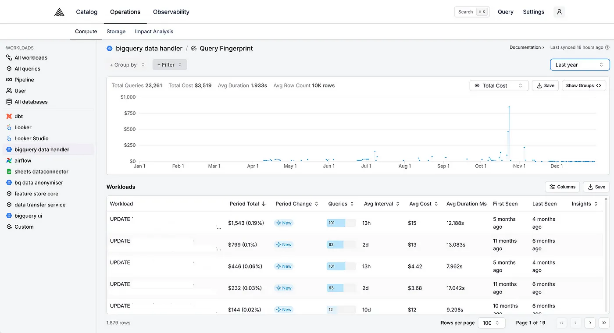
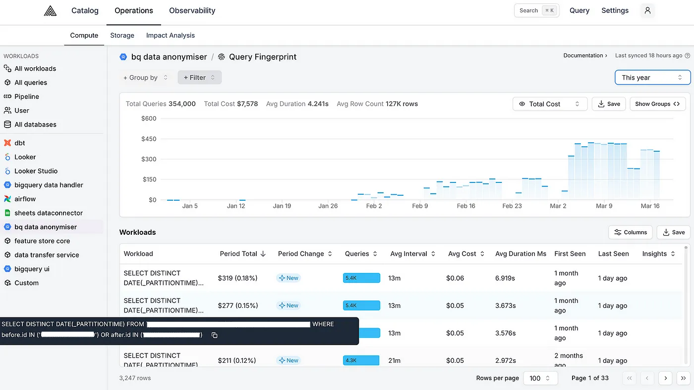
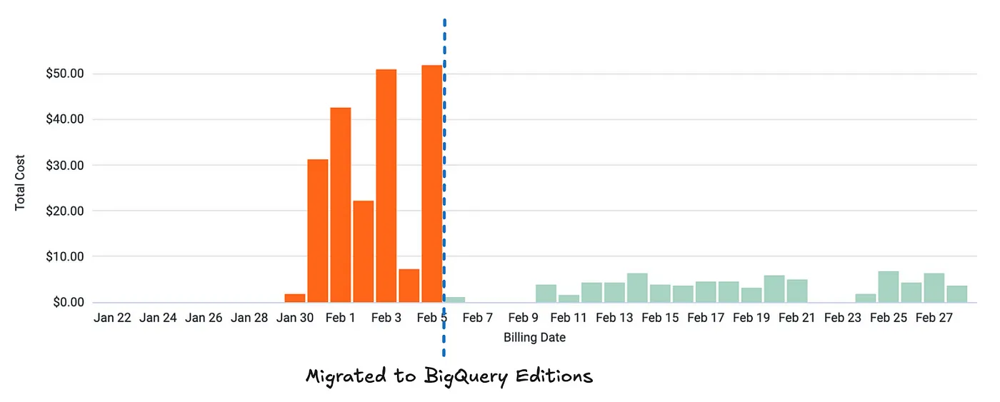

> This post was also posted on the [GoCardless Tech blog](https://medium.com/gocardless-tech/how-we-saved-3-5m-in-bigquery-costs-on-deleting-inactive-user-data-8d0ebbd012ee).

GoCardless was founded 13 years ago. Over this time, we’ve had hundreds of thousands of merchants create accounts with us and actively use our product. However, we’ve also accumulated a large number of inactive accounts over this time, leaving a lot of their data across our systems. At GoCardless we take our data responsibilities seriously, so we decided to remove this data, reducing the impact of any potential data breaches.

To reduce the costs of this project we spent a lot of time understanding how to optimise our BigQuery queries and found **5 key optimisations** that together saved us $3.5M in BigQuery costs.

## The Costs of Deleting Data in BigQuery

We planned to delete or anonymise the data of 150,000 inactive merchants from our systems. Deletions across most systems are cheap and only incur some additional computational load (e.g. deleting data from an SQL database). Deleting data from BigQuery tables is not cheap, however, [incurring a cost that’s dependent on the volume of data we want to delete](https://cloud.google.com/bigquery/docs/reference/standard-sql/dml-syntax#partitioned_tables).

After some initial profiling, we found that deleting the data of one merchant using our unoptimised implementation cost us $23.65 on average in BigQuery costs. We don’t receive data deletion requests from merchants frequently so until now these costs weren’t a major problem, but if we were to delete the data of 150,000 merchants, they would have amounted to $3.5M. These costs were very high, so we decided to implement some optimisations.

## Optimisations

We used [Alvin](https://www.alvin.ai/) to investigate our BigQuery workloads and understand which queries contribute the most to the deletion costs. Throughout this project, Alvin’s proven to be an invaluable tool to get a quick feedback loop on how effective each optimisation has been. We’d implement an optimisation, wait until the data in Alvin updates, and see what impact the optimisation has had — all in an elegant UI without needing to trawl through BigQuery audit logs!



Below, we describe each optimisation we implemented to reduce the deletion costs.

### Optimisation 1: Restricting which table partitions we delete data from

Mutating statements in BigQuery (known as [DML statements](https://cloud.google.com/bigquery/docs/reference/standard-sql/dml-syntax)) are [billed according to the amount of data they reference and modify](https://cloud.google.com/bigquery/docs/reference/standard-sql/dml-syntax#partitioned_tables). We had some deletion DML statements running on all [table partitions](https://cloud.google.com/bigquery/docs/partitioned-tables) instead of only on the partitions with the data that we wanted to delete, therefore massively driving up costs. For example, our anonymisation queries looked as follows:

```sql
UPDATE `cdc-data.live.accounts_raw`
SET after.encrypted_iban = '4451f37eeffdf5'
WHERE after.id IN ('BA0002C9')
```

To optimise them, we adjusted our application logic to first check which partitions contain the data that we want to delete by a query like so:

```sql
SELECT DISTINCT DATE(\_PARTITIONTIME)
FROM `cdc-data.live.accounts_raw`
WHERE after.id IN ('BA0002C9')
```

Then, we had our anonymisation queries only delete data in the returned partitions (if there were any), resulting in queries that look as follows:

```sql
UPDATE `cdc-data.live.accounts_raw`
SET after.encrypted_iban = '4451f37eeffdf5'
WHERE after.id IN ('BA0002C9')
AND DATE(\_PARTITIONTIME) IN ('2019-02-25','2024-08-22')
```

### Optimisation 2: Excluding some tables from deletions

We frequently needed to delete data from some large tables that contained the data of many merchants. We excluded some of these tables from deletions as they contain data that’s necessary for us to prevent fraud, as per Article 17(3)(b) of GDPR which states that the right to erasure does not apply if the processing of the data is necessary "_for compliance with a legal obligation which requires processing or for the performance of a task carried out in the public interest or in the exercise of official authority vested in the controller_".

### Optimisation 3: Eliminating repeated queries

The cost of some queries that we deemed cheap quickly added up. For example, we identified that a cheap query for retrieving which partitions a merchant’s data is in was being called many times for each request, resulting in high costs:



There was no need to run identical queries many times, so we consolidated our application logic to only run these queries once.

### Optimisation 4: Combining DML statements

For rows with multiple columns that required anonymisation, we initially executed a separate DML statement for each row. This was wasteful as each statement resulted in a full partition scan. For example, to anonymise the data in columns `iban`, `email`, and `account_holder_name` of a merchant with ID `BA0002C9`, we’d execute the following statements:

```sql
UPDATE `cdc-data.live.accounts_raw`
SET after.iban = '4451f37eeffdf5'
WHERE after.id IN ('BA0002C9')
AND DATE(\_PARTITIONTIME) IN ('2019-02-25','2024-08-22');

UPDATE `cdc-data.live.accounts_raw`
SET after.email = 'df6g9mfghh'
WHERE after.id IN ('BA0002C9')
AND DATE(\_PARTITIONTIME) IN ('2019-02-25','2024-08-22');

UPDATE `cdc-data.live.accounts_raw`
SET after.account_holder_name = 'E7085364'
WHERE after.id IN ('BA0002C9')
AND DATE(\_PARTITIONTIME) IN ('2019-02-25','2024-08-22');
```

Each statement would read the referenced partitions in full. We optimised these statements by combining them into one. For the example above, executing the following statement instead would have reduced costs by two-thirds:

```sql
UPDATE `cdc-data.live.accounts_raw`
SET after.encrypted_iban = '4451f37eeffdf5', after.email = 'df6g9mfghh', after.account_holder_name = 'E7085364'
WHERE after.id IN ('BA0002C9')
AND DATE(\_PARTITIONTIME) IN ('2019-02-25','2024-08-22')
```

We could have applied the same principle to also batch multiple requests together, further reducing costs. However, that would have come with additional architectural complexity that wouldn’t have brought in substantial enough savings in our use case.

### Optimisation 5: Executing queries under the BigQuery Enterprise editions pricing model

By reserving [BigQuery compute capacity via the BigQuery editions pricing model](https://cloud.google.com/bigquery/docs/editions-intro), our queries were billed according to how much compute power they required to run rather than how much data they queried. This resulted in cost savings of around 90%:



This optimisation was very effective as our deletion workloads run almost constantly and don’t need to finish quickly. In effect, the virtual compute units we reserve in BigQuery (called slots) are highly utilised and we don’t need to request large amounts of them, minimising the number of slots that could be wasted when the slot auto-scaler scales down.

### Final Words

After all of the above optimisations, **we’ve reduced our cost to anonymise the data of all 150,000 merchants from $3.5M to $6k**. This is a huge saving and came from many iteration cycles which frequent profiling was an essential part of. We hope that what we have learned helps you optimise your workloads!
